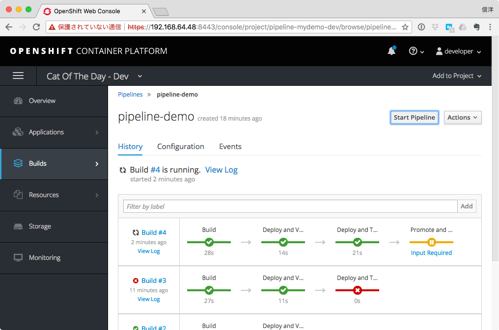
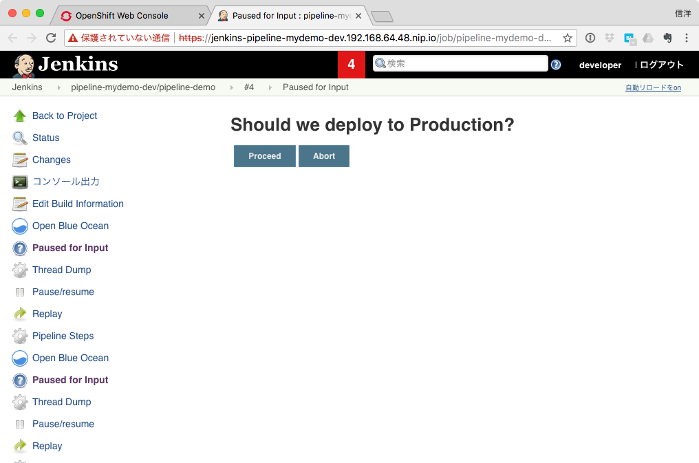

# CI/CDパイプラインによる自動化
OpenShiftではパイプラインビルド機能により、複雑なビルドやデプロイを自動化できる。

パイプラインビルドの定義を作成すると、必要に応じてJenkins Podが自動的にデプロイされ、OpenShiftクラスタ上でビルドが実行できる。
このJenkinsにはあらかじめOpenShift Pluginがインストールされており、JenKins V2のPipeline DSLの拡張によってOpenShiftへのビルドやデプロイの指示が簡単に指定できるようになっている。
また、Jenkinsの認証はOpenShiftの認証と統合されており、OpenShift上で有効なユーザーによって権限管理が行われる。

## 環境設定
```
export OCP_MASTER=https://<ocp-master-url>:<port>
```

## 事前準備
ソースコードを修正するため、あらかじめサンプルコード(PHP)をforkしておく。

フォーク元: https://github.com/StefanoPicozzi/cotd

*この手順ではフォーク先を https://github.com/nobusue/cotd
 として記述していますが、適宜読み替えてください。*

## セットアップ

### Project作成
開発(Dev) / テスト(Test) / プロダクション(Prod) の環境に対応するプロジェクトを作成する。

```
oc login $OCP_MASTER
GUID=mydemo # 任意の識別子(文字列)
oc new-project pipeline-${GUID}-dev --display-name="Cat Of The Day - Dev"
oc new-project pipeline-${GUID}-test --display-name="Cat Of The Day - Test"
oc new-project pipeline-${GUID}-prod --display-name="Cat Of The Day - Prod"
```

`GUID`には任意の文字列を指定する。(複数人で同時に作業するときにリソースの重複を回避するために利用)

### Jenkins準備
パイプラインビルド実行のため、Dev環境にJenkinsを起動する。

```
oc new-app jenkins-persistent -n pipeline-${GUID}-dev
```

### 権限設定
Dev環境のJenkinsから、Test/Prod環境のImageStream Tagを操作できるようにする。

```
oc policy add-role-to-user edit system:serviceaccount:pipeline-${GUID}-dev:jenkins -n pipeline-${GUID}-test
oc policy add-role-to-user edit system:serviceaccount:pipeline-${GUID}-dev:jenkins -n pipeline-${GUID}-prod
```

Test/Prod環境から、Dev環境のImageをpullできるようにする。

```
oc policy add-role-to-group system:image-puller system:serviceaccounts:pipeline-${GUID}-test -n pipeline-${GUID}-dev
oc policy add-role-to-group system:image-puller system:serviceaccounts:pipeline-${GUID}-prod -n pipeline-${GUID}-dev
```

### アプリケーションデプロイ
s2iビルドを利用して、Dev環境にアプリケーションをデプロイする。

```
oc new-app https://github.com/nobusue/cotd -n pipeline-${GUID}-dev
```

ビルド状況はログで確認できる。

```
oc logs -f build/cotd-1 -n pipeline-${GUID}-dev
```

### image streamタグ付け
Test環境のデプロイ対象として、Dev環境のImageStream Tag `testready` を作成する。

```
oc tag cotd:latest cotd:testready -n pipeline-${GUID}-dev
```

同様に、Prod環境のデプロイ対象として、Dev環境のImageStream Tag `prodready` を作成する。

```
oc tag cotd:testready cotd:prodready -n pipeline-${GUID}-dev
```

ImageStreamにTagが作成されたことを確認する。

```
oc describe is cotd -n pipeline-${GUID}-dev
```

### Test/Prodへアプリケーションをリリース
パイプラインで自動化する前に、一旦手動でイメージをリリースしてDeploymentConfitを生成しておく。

```
oc new-app pipeline-${GUID}-dev/cotd:testready --name=cotd -n pipeline-${GUID}-test
oc new-app pipeline-${GUID}-dev/cotd:prodready --name=cotd -n pipeline-${GUID}-prod
```

### automatic deploymentを無効化
自動生成したDeploymentConfigでは、イメージが更新されると自動的にデプロイが行われてしまうので、無効化しておく。
(パイプラインビルドからのみデプロイを指示するようにするため。)

```
oc get dc cotd -o yaml -n pipeline-${GUID}-dev | sed 's/automatic: true/automatic: false/g' | oc replace -f -
oc get dc cotd -o yaml -n pipeline-${GUID}-test| sed 's/automatic: true/automatic: false/g' | oc replace -f -
oc get dc cotd -o yaml -n pipeline-${GUID}-prod | sed 's/automatic: true/automatic: false/g' | oc replace -f -
```

### サービス公開
Dev/Test/Prod環境のアプリケーションを、ユーザーが利用可能な状態にしておく。

```
oc expose service cotd -n pipeline-${GUID}-dev
oc expose service cotd -n pipeline-${GUID}-test
oc expose service cotd -n pipeline-${GUID}-prod
```

## パイプラインビルド

### パイプラインビルド定義
Devプロジェクトで Add to Project -> Import YAML/JSON を選択し、以下を入力する。

```
apiVersion: v1
items:
- kind: "BuildConfig"
  apiVersion: "v1"
  metadata:
    name: "pipeline-demo"
  spec:
    triggers:
      - github:
          secret: 5Mlic4Le
        type: GitHub
      - generic:
          secret: FiArdDBH
          type: Generic
    strategy:
      type: "JenkinsPipeline"
      jenkinsPipelineStrategy:
        jenkinsfile: |
          node {
              stage ("Build")
                    echo '*** Build Starting ***'
                    openshiftBuild bldCfg: 'cotd', buildName: '', checkForTriggeredDeployments: 'false', commitID: '', namespace: '', showBuildLogs: 'true', verbose: 'true'
                    openshiftVerifyBuild bldCfg: 'cotd', checkForTriggeredDeployments: 'false', namespace: '', verbose: 'false'
                    echo '*** Build Complete ***'
              stage ("Deploy and Verify in Development Env")
                    echo '*** Deployment Starting ***'
                    openshiftDeploy depCfg: 'cotd', namespace: '', verbose: 'false', waitTime: ''
                    openshiftVerifyDeployment authToken: '', depCfg: 'cotd', namespace: '', replicaCount: '1', verbose: 'false', verifyReplicaCount: 'false', waitTime: ''
                    echo '*** Deployment Complete ***'
               }

kind: List
metadata: {}
```

### パイプラインビルドのテスト
Devプロジェクトで Builds->Pipeline->Start Pipeline を実行し、ビルド完了まで待つ。

待っている間に以下を解説する:

- Jenkinsとの統合
- Pipeline定義の書き方について

### CI/CDのためのパイプラインビルド定義
Devプロジェクトで Builds -> Pipeline -> Edit を選択し、以下の内容で上書きする。
`withEnv(['GUID=mydemo', 'DOMAIN=192.168.64.48.nip.io'])` の部分は、自分の環境に合わせて修正すること。

```
node {
  withEnv(['GUID=mydemo', 'DOMAIN=192.168.64.48.nip.io']) {

    stage ("Build")
    echo '*** Build Starting ***'
    openshiftBuild bldCfg: 'cotd', buildName: '', checkForTriggeredDeployments: 'false', commitID: '', namespace: '', showBuildLogs: 'false', verbose: 'false', waitTime: ''
    openshiftVerifyBuild apiURL: 'https://openshift.default.svc.cluster.local', authToken: '', bldCfg: 'cotd', checkForTriggeredDeployments: 'false', namespace: '', verbose: 'false'
    echo '*** Build Complete ***'

    stage ("Deploy and Verify in Development Env")

    echo '*** Deployment Starting ***'
    openshiftDeploy apiURL: 'https://openshift.default.svc.cluster.local', authToken: '', depCfg: 'cotd', namespace: '', verbose: 'false', waitTime: ''
    openshiftVerifyDeployment apiURL: 'https://openshift.default.svc.cluster.local', authToken: '', depCfg: 'cotd', namespace: '', replicaCount: '1', verbose: 'false', verifyReplicaCount: 'false', waitTime: ''
    echo '*** Deployment Complete ***'

    echo '*** Service Verification Starting ***'
    openshiftVerifyService apiURL: 'https://openshift.default.svc.cluster.local', authToken: '', namespace: 'pipeline-${GUID}-dev', svcName: 'cotd', verbose: 'false'
    echo '*** Service Verification Complete ***'
    openshiftTag(srcStream: 'cotd', srcTag: 'latest', destStream: 'cotd', destTag: 'testready')

    stage ('Deploy and Test in Testing Env')
    echo '*** Deploy testready build in pipeline-${GUID}-test project  ***'
    openshiftDeploy apiURL: 'https://openshift.default.svc.cluster.local', authToken: '', depCfg: 'cotd', namespace: 'pipeline-${GUID}-test', verbose: 'false', waitTime: ''

    openshiftVerifyDeployment apiURL: 'https://openshift.default.svc.cluster.local', authToken: '', depCfg: 'cotd', namespace: 'pipeline-${GUID}-test', replicaCount: '1', verbose: 'false', verifyReplicaCount: 'false', waitTime: '10'
    sh 'curl http://cotd-pipeline-${GUID}-test.${DOMAIN}/data/ | grep cats -q'

    stage ('Promote and Verify in Production Env')
    echo '*** Waiting for Input ***'
    input 'Should we deploy to Production?'
    openshiftTag(srcStream: 'cotd', srcTag: 'testready', destStream: 'cotd', destTag: 'prodready')
    echo '*** Deploying to Production ***'
    openshiftDeploy apiURL: 'https://openshift.default.svc.cluster.local', authToken: '', depCfg: 'cotd', namespace: 'pipeline-${GUID}-prod', verbose: 'false', waitTime: ''
    openshiftVerifyDeployment apiURL: 'https://openshift.default.svc.cluster.local', authToken: '', depCfg: 'cotd', namespace: 'pipeline-${GUID}-prod', replicaCount: '1', verbose: 'false', verifyReplicaCount: 'false', waitTime: '10'
    sleep 10
    sh 'curl http://cotd-pipeline-${GUID}-prod.${DOMAIN}/data/ | grep cats -q'
  }
}
```

### パイプラインビルド実行
ソースコードを修正してGitリポジトリにpushする。

修正箇所は `iuncludes/selectors.php` の以下の行:

```
diff --git a/include/selector.php b/include/selector.php
index 6727422..bc6d30d 100755
--- a/include/selector.php
+++ b/include/selector.php
@@ -49,9 +49,9 @@ if ( empty($_SESSION['SELECTOR']) ) {
         $ini_array = parse_ini_file($ini_file);     
         $_SESSION['SELECTOR'] = $ini_array['selector'];
     } elseif ( $_SESSION['V2'] == 'true' )  {
-        $_SESSION['SELECTOR'] = 'cats';
+        $_SESSION['SELECTOR'] = 'cities';
     } else {
-        $_SESSION['SELECTOR'] = 'cats';
+        $_SESSION['SELECTOR'] = 'cities';
     }

 }
```

なお、キーワードとして指定可能なのは `cats` / `cities` / `pets` のいずれかで、これにより表示対象の画像データを切り替えるようになっている。
データの実体は `cotd/data/<キーワード>.php` に定義されている。

修正後、Devプロジェクトで Builds->Pipeline->Start Pipeline を実行し、ビルド完了まで待つ。

ビルドが正常に進むと、Prod環境へのデプロイの直前で承認を求められる状態でストップするので、一旦全環境のアプリケーションを表示してみる。
Dev/Testは新しいバージョンに更新されており、Prodは旧バージョンのままになっているはず。



次に、"Proceed"に対して Yes or No を選択する。



Yesを選択すると、Prodが新しいバージョンに更新される。

## 参考情報
https://stefanopicozzi.blog/2016/10/18/pipelines-with-openshift/
https://stefanopicozzi.blog/2016/10/07/ab-deployments-made-easy-with-openshift/
