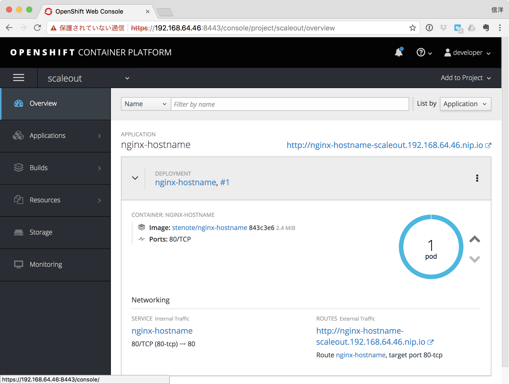

# Dockerイメージデプロイとスケールアウト、オートヒーリング

## 環境設定
```
export OCP_MASTER=https://<ocp-master-url>:<port>
```

## プロジェクト作成
```
oc login $OCP_MASTER -u developer
oc new-project scaleout
```

## rootユーザーでのコンテナ実行を許可
OpenShiftのデフォルトではrootユーザーでのコンテナ実行が禁止されているため、DockerHubで公開されているコンテナの多くがそのままでは実行できない。
以下により制限を緩和しておく。

```
oc login $OCP_MASTER -u system:admin
oc adm policy add-scc-to-user anyuid -z default -n scaleout
```

## Dockerイメージデプロイ
ホスト名を表示するNginxコンテナを実行する。
https://hub.docker.com/r/stenote/nginx-hostname/

```
oc new-app stenote/nginx-hostname
```

## サービス公開
デプロイしたコンテナを外部からアクセス可能な状態にする。

```
oc expose svc nginx-hostname
```

以下でURLを確認し、アプリケーション画面を表示してみる。

```
oc get route nginx-hostname --template='{{.spec.host}}
```

ホスト名=Pod名であることに言及する。

## スケールアウト
管理コンソールから実行


CLIから実行

```
oc scale dc nginx-hostname --replicas=4
```

## スケールアウト結果確認
Pod一覧

```
oc get po
```

ロードバランス確認

```
COUNTER=0; \
while [ $COUNTER -lt 10 ]; \
do
  curl -s http://$(oc get route nginx-hostname --template='{{.spec.host}}' -n scaleout) ; \
let COUNTER=COUNTER+1 ; \
done
```

## オートヒーリング
管理コンソールを見せた状態で、CLIからPodを止めてみる。

```
$ oc get po
$ oc delete po <PODNAME>
```

以下でPodのロケーション(配置先Node)を確認できる。

```
$ oc get pods -o wide
```

## 後始末
```
oc delete project scaleout
```
